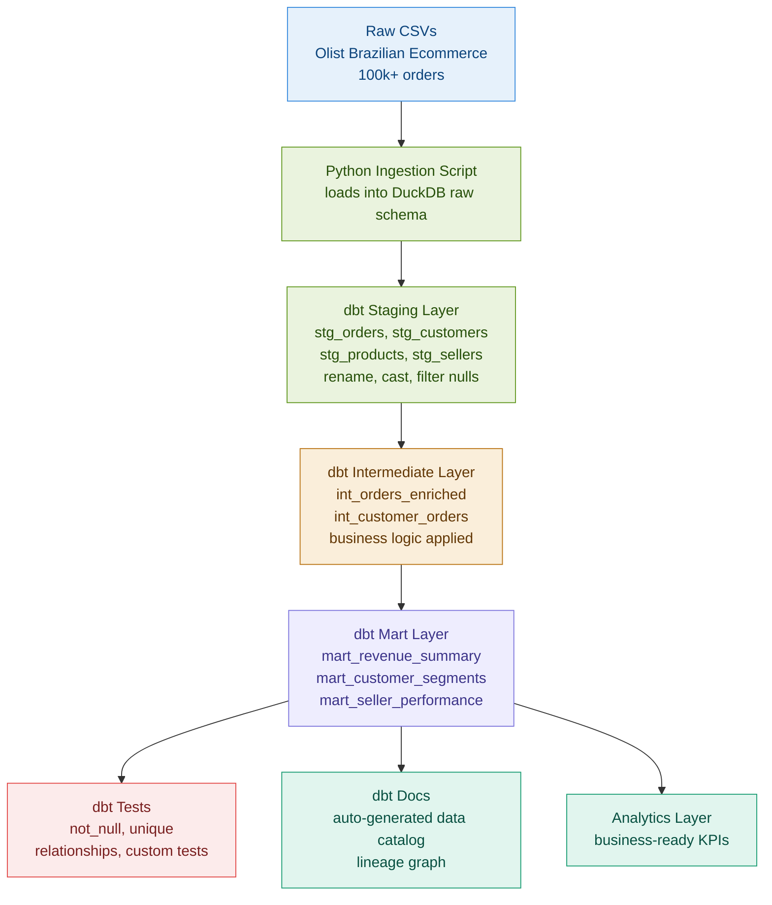

# ecommerce KPI Mart: Analytics Engineering Pipeline with dbt and DuckDB

> Raw ecommerce data is useless. Trusted, tested, documented metrics are what business teams actually need. This project builds the layer between them.

## Problem

Business teams can pull data but cannot trust it. Metrics are defined inconsistently across teams. Revenue calculated by Finance does not match revenue calculated by Sales. There is no single source of truth, no documentation of business logic, and no automated testing to catch when upstream data breaks downstream reports.

## Solution

A production analytics engineering pipeline that transforms raw ecommerce transactions into a fully tested, documented KPI mart using dbt Core and DuckDB. Every metric is defined once, tested automatically, and documented for business stakeholders.

## Architecture



## Features

- Full dbt project with staging, intermediate, and mart layers following the dbt best practice structure
- Automated testing with dbt built-in tests covering not_null, unique, and referential integrity
- Auto-generated dbt documentation with column-level descriptions and lineage graph
- Star schema dimensional model with fact and dimension tables
- KPI definitions documented in schema.yml so every metric has a single authoritative source
- DuckDB as the analytical engine, no database server required

## KPIs Produced

| KPI | Definition | Business Use |
|---|---|---|
| Total Revenue | Sum of payment values across all orders | Executive reporting |
| Average Order Value | Total revenue divided by order count | Pricing strategy |
| Customer Lifetime Value | Revenue per customer across all orders | Retention targeting |
| Order to Delivery Days | Average days from order to delivery | Operations monitoring |
| Seller Performance Score | Revenue and rating composite per seller | Vendor management |
| Customer Segment Distribution | New, returning, and high-value customer counts | Marketing segmentation |
| Monthly Revenue Trend | Revenue aggregated by month | Finance reporting |
| Category Revenue Mix | Revenue breakdown by product category | Merchandising decisions |

## dbt Model Summary

| Layer | Models | Purpose |
|---|---|---|
| Staging | 5 models | Clean and standardize raw data |
| Intermediate | 2 models | Apply business logic and joins |
| Marts | 3 models | Business-ready KPI outputs |
| **Total** | **10 models** | |

## Dataset

Source: Olist Brazilian Ecommerce (Kaggle)
- 100,000+ orders from 2016 to 2018
- 9 CSV files covering orders, customers, products, sellers, payments, and reviews
- Real ecommerce transaction data with realistic quality issues

## Tech Stack

| Tool | Purpose |
|---|---|
| dbt Core | Transformation, testing, documentation |
| DuckDB | Analytical query engine |
| Python | Data ingestion script |
| SQL | All transformation logic |
| GitHub | Version control and CI |

## Project Structure

```text
ecommerce-kpi-mart/
  models/
    staging/
      stg_orders.sql
      stg_customers.sql
      stg_products.sql
      stg_sellers.sql
      stg_order_payments.sql
    intermediate/
      int_orders_enriched.sql
      int_customer_orders.sql
    marts/
      mart_revenue_summary.sql
      mart_customer_segments.sql
      mart_seller_performance.sql
    schema.yml
  seeds/
  tests/
  analysis/
    revenue_insights.sql
  dbt_project.yml
  README.md
```

## How to Run

```bash
git clone https://github.com/Tarun-B-12/ecommerce-kpi-mart.git
cd ecommerce-kpi-mart
pip install dbt-duckdb
python ingest.py
dbt run
dbt test
dbt docs generate
dbt docs serve
```

## dbt Test Results

All 10 models pass the full test suite including not_null checks on primary keys, unique checks on order IDs and customer IDs, and referential integrity checks between fact and dimension tables.

## Limitations

- DuckDB is not suitable for concurrent multi-user production environments. Production version would use Snowflake or BigQuery.
- No incremental models. Production version would implement incremental materialization for large tables.
- No orchestration. Production version would use Airflow or dbt Cloud for scheduled runs.

## Future Improvements

- Add incremental materialization for fact tables
- Connect to Snowflake or BigQuery as the warehouse backend
- Add dbt Cloud for scheduled runs and CI/CD integration
- Add forecasting models using dbt Python models
- Add data freshness monitoring

## What This Project Demonstrates

- Analytics engineering best practices with dbt staging, intermediate, and mart layers
- Dimensional modeling and star schema design
- Automated data quality testing with dbt
- KPI definition and documentation for business stakeholders
- DuckDB as a modern lightweight analytical engine
- Production pipeline thinking: single source of truth, tested metrics, documented logic
