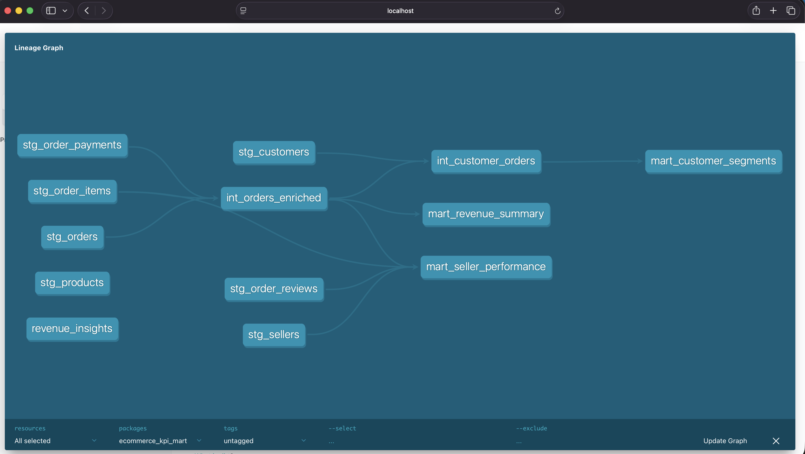

# E-Commerce Analytics Engineering KPI Mart

## One-Line Summary
A production-style analytics engineering project using dbt Core and DuckDB to transform 100k+ raw e-commerce orders into a clean, tested, and documented KPI mart ready for BI consumption.

## Business Problem
E-commerce operations teams need reliable, consistent KPIs for revenue, customer behavior, and seller performance. Raw transactional data is rarely dashboard-ready. This project builds the transformation layer that sits between raw data and the BI layer: staging models that clean and type-cast, intermediate models that apply business logic, and mart models that produce the final KPI tables stakeholders trust.

## Target Stakeholder
Analytics Manager, BI Engineer, Head of E-Commerce Operations, anyone who owns the single source of truth for revenue and order metrics.

## Tools Used
- dbt Core (transformation framework, all model layers)
- DuckDB (local analytical database, zero config)
- Python (raw data ingestion script)
- SQL (all transformation and analysis logic)
- GitHub (version control)

## Dataset
Source: Brazilian E-Commerce Public Dataset by Olist (Kaggle)

- 100k+ real anonymized orders across 2016 to 2018
- 8 related tables: orders, order items, customers, sellers, products, payments, reviews, geolocation
- Public, de-identified data with no privacy concerns

## Project Architecture

```text
Raw CSVs (Olist Kaggle)
        |
        v
Python ingestion script (loads CSVs into DuckDB raw schema)
        |
        v
dbt Staging Layer
  stg_orders, stg_order_items, stg_customers,
  stg_sellers, stg_products, stg_order_payments, stg_order_reviews
  (rename columns, cast types, filter nulls)
        |
        v
dbt Intermediate Layer
  int_orders_enriched (orders joined to items and payments)
  int_customer_orders (customer-level order history and segmentation)
        |
        v
dbt Mart Layer
  mart_revenue_summary (daily revenue KPIs)
  mart_customer_segments (customer segmentation and revenue tiers)
  mart_seller_performance (seller KPIs and delivery performance)
        |
        v
Analysis queries (revenue_insights.sql)
```

## Lineage Graph


## KPIs
| KPI | Definition |
|---|---|
| Gross Revenue | Sum of order item prices before freight |
| Average Order Value | Gross revenue divided by order count |
| Late Delivery Rate | Orders delivered after estimated date divided by total delivered |
| Customer Segment | One-Time Buyer, Repeat Buyer, or Loyal Buyer based on order count |
| Revenue Tier | High Value, Mid Value, or Low Value based on total customer spend |
| Seller Avg Review Score | Average customer review score per seller |
| Days to Deliver | Days from order placed to customer delivery |

## dbt Model Summary
| Model | Layer | Type | Description |
|---|---|---|---|
| stg_orders | Staging | View | Cleaned orders with typed timestamps |
| stg_order_items | Staging | View | Item-level prices and freight values |
| stg_customers | Staging | View | Customer locations and unique IDs |
| stg_sellers | Staging | View | Seller locations |
| stg_products | Staging | View | Product attributes and categories |
| stg_order_payments | Staging | View | Payment types and values |
| stg_order_reviews | Staging | View | Review scores and timestamps |
| int_orders_enriched | Intermediate | View | Orders joined to items and payments |
| int_customer_orders | Intermediate | View | Customer-level order history |
| mart_revenue_summary | Mart | Table | Daily revenue KPIs |
| mart_customer_segments | Mart | Table | Customer segmentation |
| mart_seller_performance | Mart | Table | Seller KPIs |

## Data Quality
- 46 dbt tests across all layers including not_null, unique, accepted_values, and relationship checks
- All 46 tests passing across 12 models
- Null handling applied at staging layer
- Duplicate customer IDs resolved using customer_unique_id at intermediate layer
- Raw dataset column name typos documented in model comments

## Key Business Insights
- Revenue peaked in late 2017 and early 2018
- The majority of customers are one-time buyers, indicating low repeat purchase rate
- Late delivery rate varies significantly by seller and state
- Credit card is the dominant payment method across all order months
- Top sellers by revenue are concentrated in Sao Paulo state

## Limitations
- Dataset covers 2016 to 2018 only, no recent data
- Geolocation table not used in current models
- No product category translation applied in mart layer
- Delivery performance metrics depend on data completeness of delivery timestamps

## Next Improvements
- Add product category translation to mart models
- Add forecasting model for monthly revenue
- Connect mart tables to Tableau Public or Looker Studio for visualization
- Add dbt source freshness checks
- Deploy dbt docs as a GitHub Pages site

## What This Project Demonstrates
- Production-style dbt project structure with staging, intermediate, and mart layers
- Data modeling with refs, CTEs, and layered transformations
- Data quality testing with 46 automated dbt tests
- Business logic separation from raw data cleaning
- Analytics engineering best practices for KPI mart design
- DuckDB as a lightweight local analytical database
- End-to-end pipeline from raw CSV to BI-ready tables